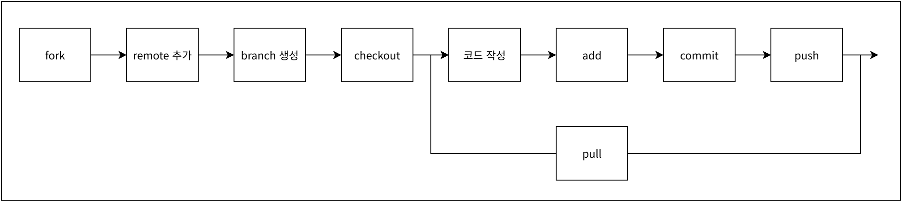
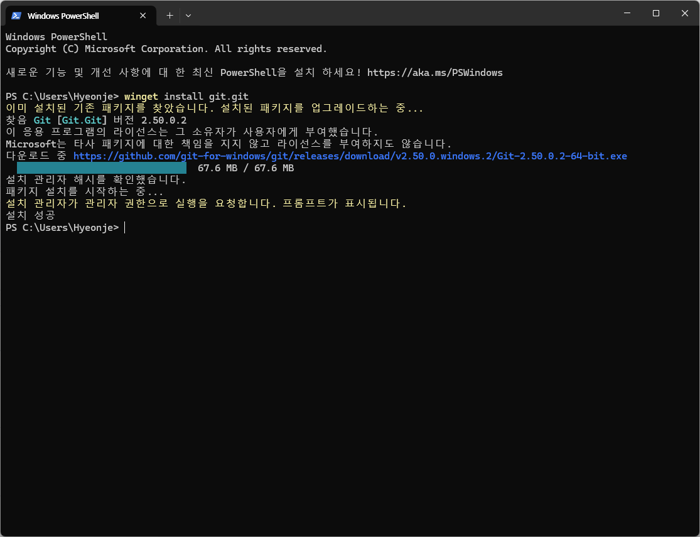
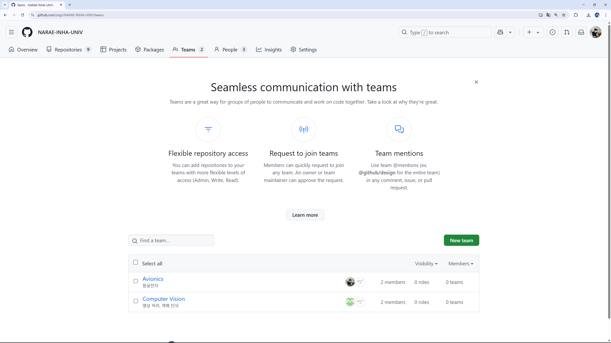
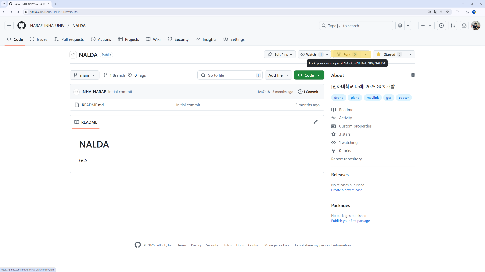
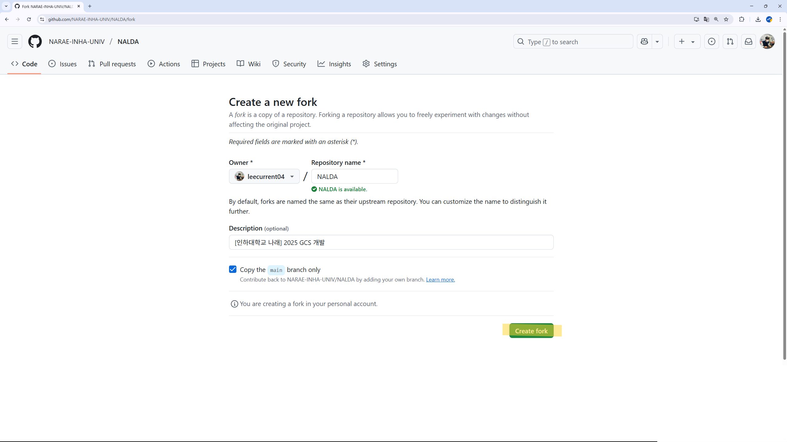
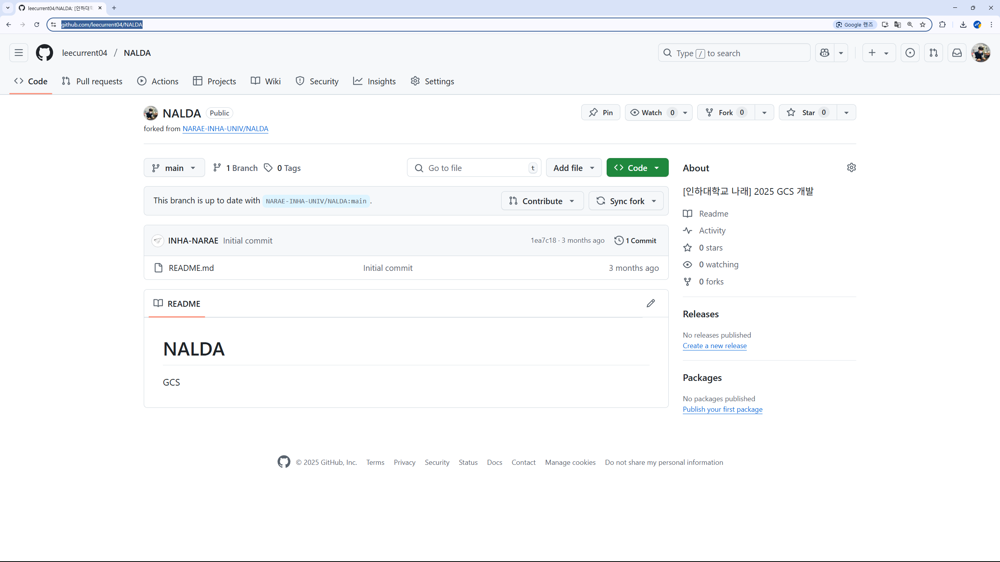
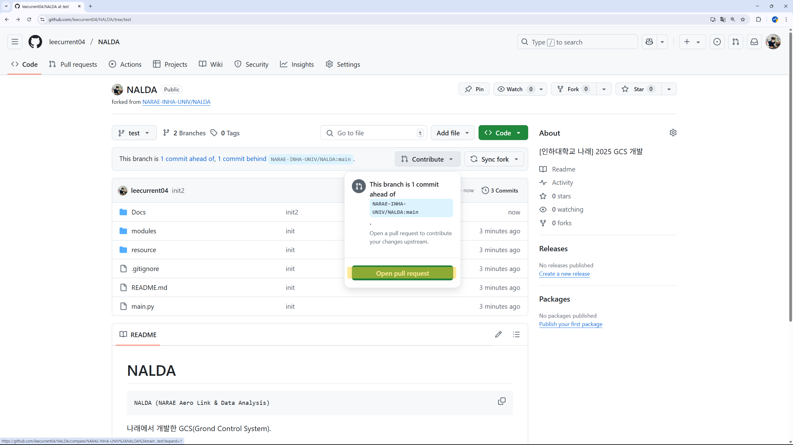
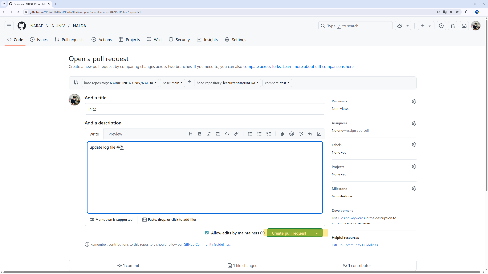
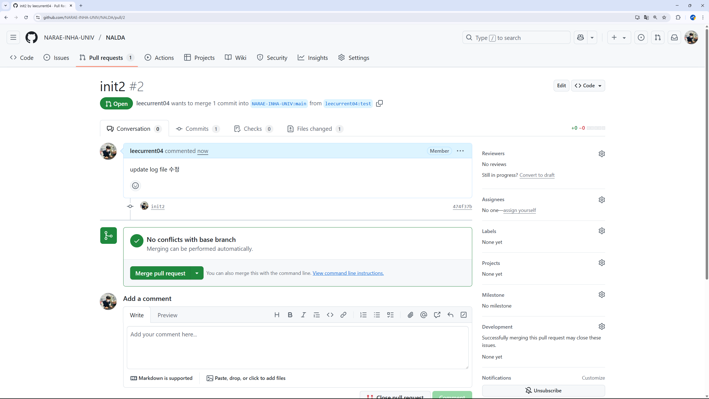
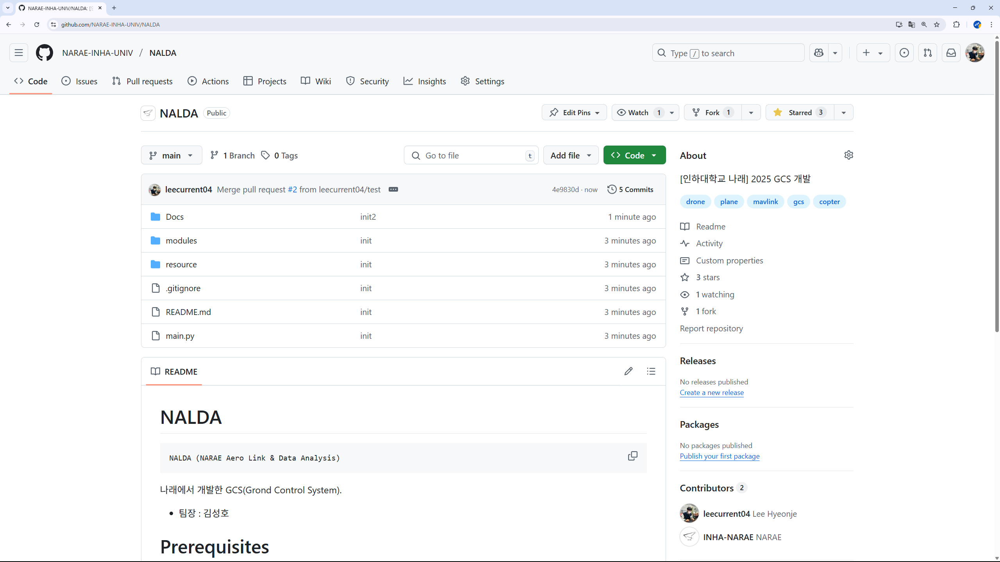

# Git 사용법

개발 과정은 다음 순서를 따른다.



## 0. Git 설치

로컬 PC에 Git을 설치한다.

윈도우 : 
```bash
$ winget install git.git
```

데비안 (우분투, 리눅스 민트 등) :
```bash
$ sudo apt install git
```




## 1. 팀에 속해 있는지 확인



비공개 레파지토리에 접근하기 위해 팀에 속해 있는지 확인하고, 아닐 경우 팀장에게 요청하여 팀에 가입한다.

## 2. 레파지토리 Fork




작업할 레파지토리를 포크하여 개인 깃헙에 레파지토리를 생성한다.<br>
이때 원래 레파지토리를 **upstream**, 개인 깃헙 레파지토리를 **origin**으로 칭한다.<br>

## 3. 로컬에 Git 로드



**origin**에서 프로젝트를 다운 받는다.

```bash
$ git clone [레파지토리 url]
$ cd [레파지토리 이름]
$ git init . 
```


## 4. upstream 추가

**upstream** 저장소를 추가해야, 다른 팀원이 작업한 내역을 로컬에 반영할 수 있다.

```bash
$ git remote add upstream [upstream URL]
$ git remote -v     # 예시
origin  https://github.com/leecurrent04/NALDA (fetch)
origin  https://github.com/leecurrent04/NALDA (push)
upstream        https://github.com/NARAE-INHA-UNIV/NALDA (fetch)
upstream        https://github.com/NARAE-INHA-UNIV/NALDA (push)
```


## 5. branch 생성

작업하기 전에 branch를 생성하여 작업하는 것이 좋다.<br>
코드가 완성 되지 않았거나 테스트가 필요한 경우에, **main** 브랜치에 반영하면 팀원에게 혼란을 유발할 수 있다. <br>
따라서 **main** 브랜치에 올리지 말고, 모듈 별로 브랜치를 생성하여 자주 올리는 것을 권장한다.<br>

```bash
$ git branch test
$ git branch -v     # 예시
* main 1ea7c18 Initial commit
  test 1ea7c18 Initial commit
$ git checkout test
```

## 6. 작업 후 git 반영

코드 작성이나 회로도 작업 후, add 명령을 통해 git에서 파일을 추적할 수 있도록 한다.<br>
commit 명령은 작업한 내역을 기록하는 것으로, 하지 않으면 저장이 안된다. <br>
로컬에서 commit한 내역을 원격 저장소(개인 git 레포)에 업로드하기 위해 pull 명령을 사용한다.

```bash
$ git add .
$ git status
$ git commit -m "작업한 내역"
$ git push
```
## 7. Pull-request 하기

**origin**(개인 git 레포)에서 **upstream**에 공유하기 위해서 Pull-request를 열어야 한다.







작업 내역을 잘 작성하여 관리자가 확인 할 수 있도록 한 후, 제출하면 된다.<br>
이후 관리자가 병합하면 **upstream**에 기록되어 팀원이 확인할 수 있다.


